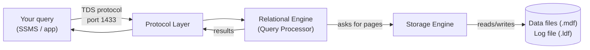
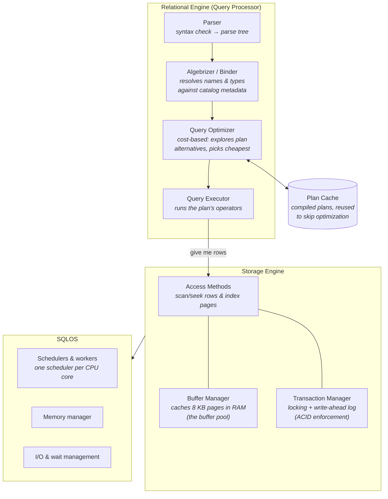
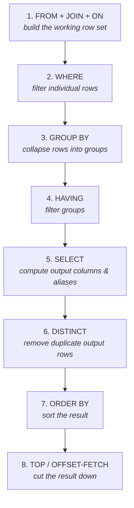
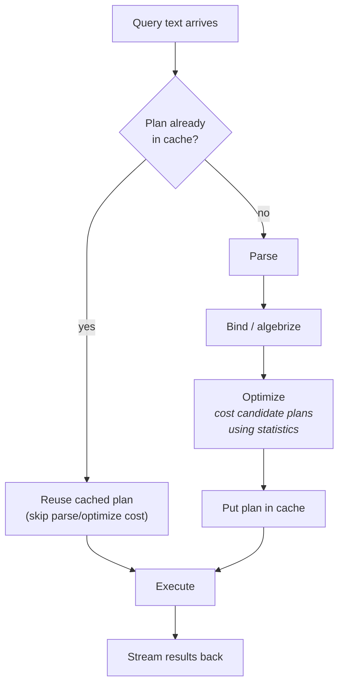
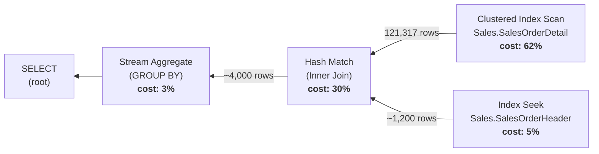
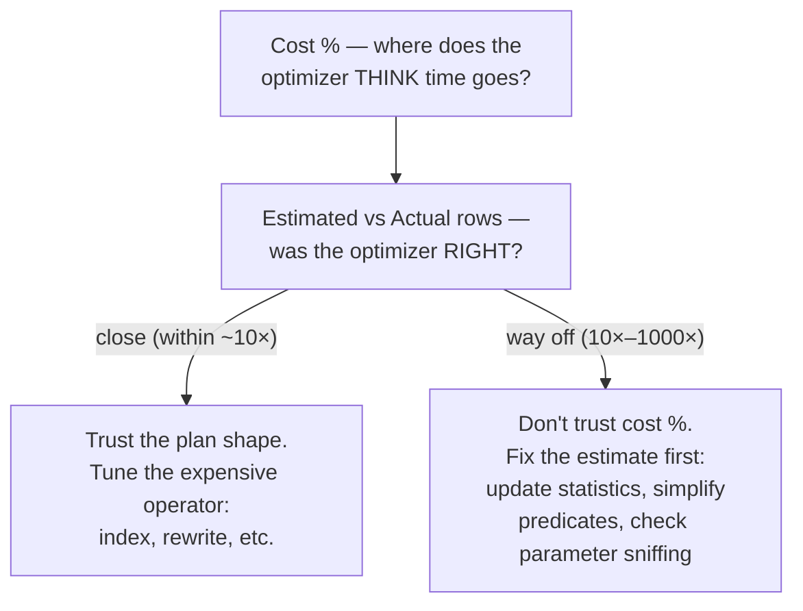

# How MSSQL Works Cheatsheet

The mental model behind everything else in this curriculum: what happens between you pressing
F5 and rows appearing in the results grid. If you understand the diagrams here, you don't need
to memorize rules — you can *derive* them.

---

## The Big Picture: What Happens to Your Query



Two engines do the real work, and they have a strict division of labor:

| Engine | Job | Thinks in terms of |
|---|---|---|
| **Relational Engine** | Figure out *how* to answer the query (parse, optimize, execute the plan) | Rows, operators, plans |
| **Storage Engine** | Actually fetch/modify the data, safely | Pages, locks, transactions, the log |

The relational engine never touches disk. It asks the storage engine for rows; the storage
engine deals with pages, the buffer pool, locking, and the transaction log.

---

## Component Detail



What each piece does:

| Component | Detail |
|---|---|
| **Parser** | Checks T-SQL syntax. A typo like `SELCT` dies here. Produces a parse tree. |
| **Algebrizer (binder)** | Resolves every name: does `Sales.SalesOrderHeader` exist? Is `OrderDate` a column? What type is it? "Invalid object name" errors come from here — proof that binding happens *before* execution. |
| **Optimizer** | The most complex part of the product. Generates many candidate plans, estimates the cost of each using **statistics** (histograms of column value distributions), and picks the cheapest *it found within its time budget* — not a guaranteed global optimum. |
| **Plan cache** | Compiled plans are cached and reused by subsequent identical queries. This is why parameterized queries matter, and why a plan compiled for unusual parameter values can be slow for typical ones ("parameter sniffing"). |
| **Query executor** | Walks the plan tree, pulling rows from operator to operator. |
| **Access methods** | The storage engine's API for the executor: row/index scans, seeks, inserts, updates, deletes. |
| **Buffer manager** | All page reads/writes go through RAM. A page read from disk stays cached in the **buffer pool**; "logical reads" = pages read from cache, "physical reads" = pages that had to come from disk. |
| **Transaction manager** | Locking (so concurrent transactions don't corrupt each other) and **write-ahead logging**: every change is written to the log (.ldf) *before* the data page is written, which is what makes COMMIT durable and ROLLBACK/crash-recovery possible. |
| **SQLOS** | SQL Server's own internal "operating system": schedules workers onto CPUs cooperatively, manages memory grants, tracks every microsecond a worker spends waiting (the wait-stats system). |

---

## Logical Execution Order of a SELECT

The order you *write* clauses is not the order they're *evaluated*. This single diagram
explains most "why can't I do that?" errors in SQL.



You can *derive* the classic gotchas from this order instead of memorizing them:

| Gotcha | Why (from the diagram) |
|---|---|
| `WHERE TotalDue > 1000` works, `WHERE SUM(TotalDue) > 1000` doesn't | WHERE (step 2) runs before GROUP BY (step 3) — no groups exist yet to aggregate. Use HAVING. |
| Can't use a SELECT alias in WHERE | The alias is created in step 5; WHERE ran back at step 2. |
| *Can* use a SELECT alias in ORDER BY | ORDER BY (step 7) runs after SELECT (step 5). |
| `HAVING` requires aggregate or grouped columns | It filters *groups* (step 4), so a bare row-level column is ambiguous. |
| Filtering in `ON` vs `WHERE` differs for OUTER joins | ON applies *during* the join (step 1, before NULL-extended rows are added); WHERE filters *after*, which can turn a LEFT JOIN into an effective INNER JOIN. |
| `TOP` without `ORDER BY` returns arbitrary rows | TOP (step 8) just cuts whatever arrives; only ORDER BY (step 7) defines "first". |

> This is the **logical** order — the contract for what the result must be. The optimizer is
> free to physically execute things in any order that produces the same result (e.g., pushing
> a WHERE predicate down into an index seek during step 1).

---

## From Query to Plan: The Lifecycle



Key consequence: **the optimizer's choices are only as good as its statistics.** If statistics
are stale (say, a table grew 10× since the last update), the optimizer's row estimates are
wrong, it may pick the wrong join strategy, and the query is slow *even though nothing about
the query changed*. Comparing estimated vs actual row counts in a plan is how you diagnose this.

---

## Reading an Execution Plan

An execution plan is the optimizer's chosen recipe, drawn as a tree of operators.

**Read it right to left, top to bottom.** Data starts at the leaves (the operators touching
tables/indexes, drawn on the right) and flows left along the arrows into the root.



How to walk any plan:

1. **Find the expensive operators first** — the cost % on each operator says where the
   optimizer thinks the time goes. Start your tuning there (62% scan above = prime suspect).
2. **Follow the arrows** — arrow thickness in SSMS is proportional to row count. A fat arrow
   feeding a join that outputs a thin arrow means lots of work discarded: could a filter have
   been applied earlier (e.g., by an index)?
3. **Hover everything** — tooltips show estimated vs actual rows, predicates, output columns.
4. **Check seek vs scan at the leaves** — a *seek* navigates the index B-tree straight to the
   matching rows; a *scan* reads everything. Scans on large tables under selective WHERE
   clauses usually mean a missing or unusable index.

| Plan element | What to look at |
|---|---|
| Leftmost (root) operator | The statement type; its tooltip has the total plan cost |
| Rightmost (leaf) operators | How tables are accessed: seek (targeted) vs scan (everything) |
| Arrows | Row counts flowing between operators (thickness ≈ rows) |
| Warning icons (⚠) | Spills to tempdb, missing statistics, implicit conversions — always investigate |
| Join operators | Nested Loops (small outer input), Hash Match (large unsorted inputs), Merge (pre-sorted inputs) |

---

## Reading Cost

"Cost" trips everyone up, so be precise about what it is:

- **Cost is an estimate, not a measurement.** It's the optimizer's internal currency — a
  unitless number (historically "seconds on a 1990s developer's machine") combining estimated
  I/O and CPU. It is *never* updated by what actually happened at runtime.
- **Operator cost %** = that operator's share of the total estimated plan cost. Use it to find
  where to look first.
- **Estimated Subtree Cost** (on the root operator's tooltip) = the whole plan's cost. This is
  the number the optimizer minimized, and what `cost threshold for parallelism` compares against.
- **Even an "Actual" plan shows *estimated* costs.** The actual plan adds real row counts and
  timings next to the estimates — it does not re-cost the operators.

So the workflow for finding *real* pain is:



And measure reality directly:

```sql
SET STATISTICS IO ON;    -- logical reads per table (pages touched in cache)
SET STATISTICS TIME ON;  -- CPU time and elapsed time
GO
SELECT ...;
```

**Logical reads** (from `STATISTICS IO`) is the best single tuning metric: it's stable across
runs (unlike elapsed time, which depends on cache warmth and machine load) and directly counts
work done. If a change drops logical reads from 12,000 to 40, you made it faster — whatever
the cost % said.

| Number | Source | Trust it for |
|---|---|---|
| Cost % / subtree cost | Optimizer estimate | Deciding where to *look* first |
| Estimated rows | Statistics | Judging whether the optimizer understood your data |
| Actual rows | Runtime | The truth; compare against estimates |
| Logical reads | `SET STATISTICS IO` | Before/after comparison when tuning |
| CPU / elapsed time | `SET STATISTICS TIME` | Final sanity check |

---

## Where the Curriculum Drills Deeper

| Topic on this sheet | Goes deeper in |
|---|---|
| Logical execution order | Lesson 02 (SELECT), `cheatsheets/01-tsql-syntax.md` |
| Joins & their physical operators | Lesson 04, `cheatsheets/03-joins-and-sets.md` |
| Indexes, seeks vs scans, B-trees | Lessons 12 & 14, `cheatsheets/05-indexes.md` |
| Execution plans & tuning workflow | Lessons 13 & 15, `cheatsheets/06-execution-plans.md` |
| Buffer pool & the transaction log | Lesson 16 |
| Locking & waits (SQLOS) | Lessons 11 & 17 |
