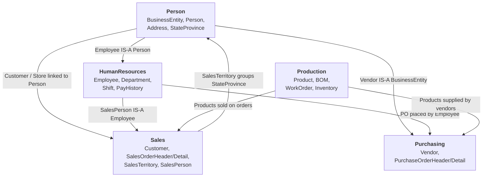
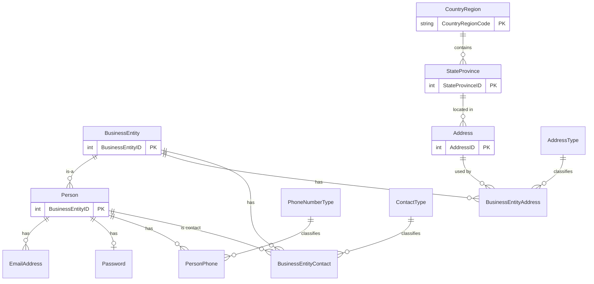
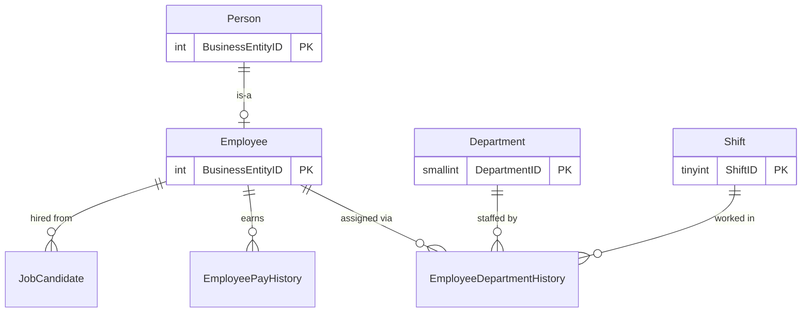
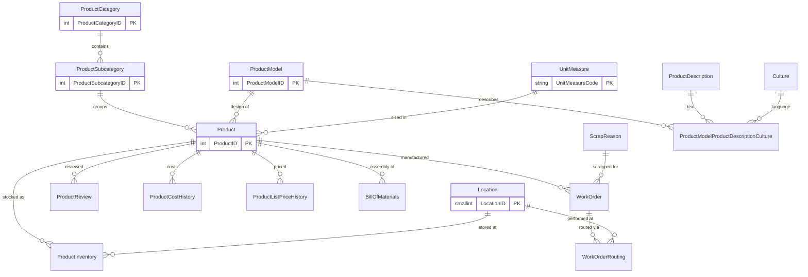
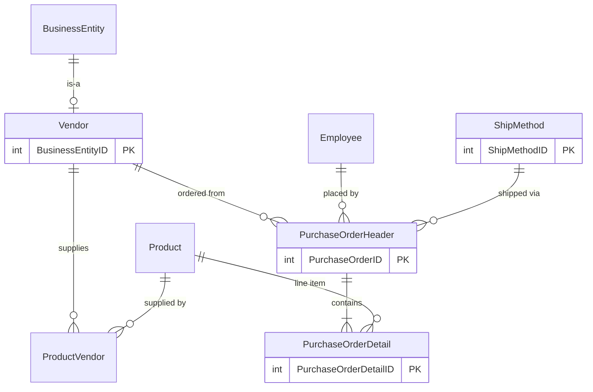
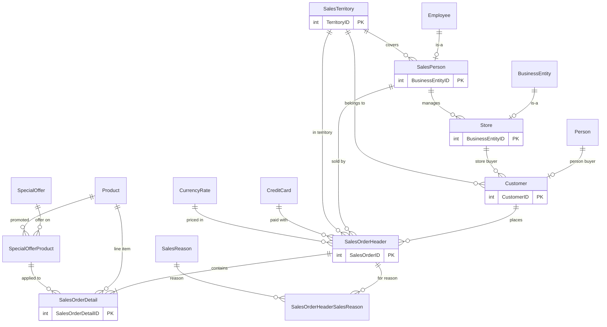

# AdventureWorks Download Instructions

The AdventureWorks2022 backup file is not included in this repository (it is ~200 MB and gitignored).

## Download

1. Go to the Microsoft SQL Server Samples releases page:
   https://github.com/Microsoft/sql-server-samples/releases/tag/adventureworks

2. Download **`AdventureWorks2022.bak`** (the full OLTP database, ~200 MB).

## Install

3. Place the downloaded file in the `backups/` directory at the root of this repo:

   ```
   mssql/
   └── backups/
       └── AdventureWorks2022.bak   ← here
   ```

4. Run the restore script (container must already be running):

   ```powershell
   .\scripts\restore-adventureworks.ps1
   ```

5. Verify:

   ```powershell
   .\scripts\connect.ps1
   ```

   Then in the sqlcmd prompt:

   ```sql
   SELECT TOP 3 FirstName, LastName FROM AdventureWorks2022.Person.Person;
   GO
   ```

## Connection Details

| Field | Value |
|---|---|
| Server name | `localhost,1433` |
| Authentication | SQL Server Authentication |
| Login | `sa` |
| Password | value of `SA_PASSWORD` in `docker/.env` |

**SSMS / Azure Data Studio:** paste `localhost,1433` into the *Server name* field, choose *SQL Server Authentication*, enter `sa` and your password.

**ADO.NET connection string:**
```
Server=localhost,1433;Database=AdventureWorks2022;User Id=sa;Password=YourStr0ngP@ssword!;TrustServerCertificate=True;
```

**ODBC / DSN:**
```
Driver={ODBC Driver 18 for SQL Server};Server=localhost,1433;Database=AdventureWorks2022;Uid=sa;Pwd=YourStr0ngP@ssword!;TrustServerCertificate=yes;
```

> `TrustServerCertificate=True` is required because the container uses a self-signed certificate.

---

## Re-seeding

If you make changes you want to undo, run:

```powershell
.\scripts\reset-db.ps1
```

This drops and re-restores AdventureWorks (including any lesson schemas you created).

---

## Database Schema

AdventureWorks2022 models a fictional bicycle manufacturer ("Adventure Works Cycles").
Its ~70 tables are organized into **five schemas**, each owning one business area:

| Schema | Business area | Key tables |
|---|---|---|
| `Person` | People, organizations, addresses | `Person`, `BusinessEntity`, `Address` |
| `HumanResources` | Employees, departments, pay | `Employee`, `Department`, `Shift` |
| `Production` | Products, BOM, manufacturing, inventory | `Product`, `BillOfMaterials`, `WorkOrder` |
| `Purchasing` | Vendors and purchase orders | `Vendor`, `PurchaseOrderHeader` |
| `Sales` | Customers, orders, territories, pricing | `Customer`, `SalesOrderHeader`, `SalesTerritory` |

The diagrams below show the foreign-key relationships within each schema, followed by the
key cross-schema links that tie everything together.

> Cardinality notation: `||--o{` = "one to zero-or-many", `||--|{` = "one to one-or-many",
> `||--||` = "one to exactly one". Only the most important key columns are shown.

### How the schemas connect (high level)



The central design idea is the **`Person.BusinessEntity`** table: a *BusinessEntity* is anything
that can have addresses and contacts. A `Person`, a `Store`, and a `Vendor` are all
BusinessEntities (they share its `BusinessEntityID`), which is why people, stores, and vendors
can reuse the same address/contact machinery.

### Person schema

People, the companies/stores they belong to, and their addresses, phones, and emails.



| Table | What it holds |
|---|---|
| `BusinessEntity` | Root identity for anything addressable (people, stores, vendors). Just an ID + rowguid. |
| `Person` | Individuals: name, title, person type (employee, customer, vendor contact…). Shares its PK with `BusinessEntity`. |
| `EmailAddress`, `PersonPhone`, `Password` | A person's contact details and login hash. |
| `PhoneNumberType` | Lookup: Home / Work / Cell. |
| `Address` | A physical street address; points to a `StateProvince`. |
| `AddressType` | Lookup: Billing / Shipping / Home / etc. |
| `BusinessEntityAddress` | Junction: which entity uses which address, in what role. |
| `BusinessEntityContact` / `ContactType` | Junction linking a person as a contact for an entity, with a role. |
| `StateProvince` | State/province; rolls up to a `CountryRegion` and a sales `Territory`. |
| `CountryRegion` | Country lookup (ISO code). |

### HumanResources schema

Employees and the org structure around them. Note `Employee` *is* a `Person`.



| Table | What it holds |
|---|---|
| `Employee` | One row per employee: job title, hire date, gender, salaried flag. PK = `BusinessEntityID` (so it's also a `Person`). Has a self-referencing org hierarchy via `OrganizationNode` (hierarchyid). |
| `Department` | Departments grouped by `GroupName` (Engineering, Sales & Marketing…). |
| `Shift` | Day / Evening / Night shifts with start & end times. |
| `EmployeeDepartmentHistory` | Junction: which employee worked in which department on which shift, over time. |
| `EmployeePayHistory` | Pay-rate changes over time for each employee. |
| `JobCandidate` | Résumés (XML) of applicants, optionally linked to a hired employee. |

### Production schema

Products and everything about making them: categories, models, bill of materials, work orders, inventory.



| Table | What it holds |
|---|---|
| `Product` | The master catalog row: name, number, color, cost, list price, size/weight, reorder point. |
| `ProductCategory` → `ProductSubcategory` | Two-level catalog hierarchy (e.g. Bikes → Mountain Bikes). |
| `ProductModel` | A design/model shared by several products; links to descriptions and illustrations. |
| `ProductDescription` / `Culture` / `…DescriptionCulture` | Localized marketing text per language. |
| `UnitMeasure` | Lookup of units (EA, KG, CM…) used for size, weight, and BOM quantities. |
| `BillOfMaterials` | Self-join on `Product`: which component products make up an assembly product, and how many. |
| `Location` | Manufacturing/inventory locations (e.g. Frame Forming, Final Assembly). |
| `ProductInventory` | Quantity on hand per product **per location** (per bin/shelf). |
| `WorkOrder` | A manufacturing order to build N of a product; tracks scrap. |
| `WorkOrderRouting` | The operations/steps a work order goes through, by location. |
| `ScrapReason` | Lookup of why product was scrapped. |
| `ProductReview` | Customer reviews of a product. |
| `ProductCostHistory` / `ProductListPriceHistory` | Cost and price changes over time. |

### Purchasing schema

Buying raw materials and products from vendors.



| Table | What it holds |
|---|---|
| `Vendor` | Companies AdventureWorks buys from. PK = `BusinessEntityID` (also a `BusinessEntity`). |
| `ProductVendor` | Junction: which vendor can supply which product, at what lead time and price. |
| `PurchaseOrderHeader` | A purchase order: vendor, ordering employee, ship method, status, totals. |
| `PurchaseOrderDetail` | Line items: product, ordered/received/rejected quantities, unit price. |
| `ShipMethod` | Shipping carriers/methods with base and per-unit rates (shared with Sales). |

### Sales schema

Customers, orders, salespeople, territories, currencies, and promotions — the largest schema.



| Table | What it holds |
|---|---|
| `Customer` | Every buyer. A customer is **either** an individual (`PersonID`) **or** a `Store`, and sits in a `SalesTerritory`. |
| `Store` | Reseller stores. PK = `BusinessEntityID`; has a managing `SalesPerson` and demographics XML. |
| `SalesPerson` | Employees who sell. PK = `BusinessEntityID` (also an `Employee`); has a quota, bonus, and territory. |
| `SalesTerritory` | Geographic territories (Northwest, Canada, France…) with running sales totals. |
| `SalesTerritoryHistory` / `SalesPersonQuotaHistory` | Time-series of territory assignments and quota changes. |
| `SalesOrderHeader` | One row per customer order: customer, salesperson, addresses, ship method, status, totals. |
| `SalesOrderDetail` | Line items: product, quantity, unit price, discount, applied special offer. |
| `SpecialOffer` / `SpecialOfferProduct` | Promotions and which products they apply to. |
| `SalesReason` / `SalesOrderHeaderSalesReason` | Why a customer bought (Price, Promotion, Review…). |
| `CreditCard` / `PersonCreditCard` | Cards on file and which person owns them. |
| `Currency` / `CurrencyRate` / `CountryRegionCurrency` | Currencies and exchange rates used for pricing. |
| `SalesTaxRate` | Tax rate per state/province. |
| `ShoppingCartItem` | In-progress online cart contents. |

### Cross-schema relationships (the important joins)

These are the foreign keys that cross schema boundaries — the ones you'll use most when writing queries:

```mermaid
flowchart LR
    subgraph Person
        P[Person.Person]
        BE[Person.BusinessEntity]
        ADDR[Person.Address]
        SP[Person.StateProvince]
    end
    subgraph HumanResources
        EMP[HR.Employee]
    end
    subgraph Sales
        CUST[Sales.Customer]
        STORE[Sales.Store]
        SLP[Sales.SalesPerson]
        SOH[Sales.SalesOrderHeader]
        TERR[Sales.SalesTerritory]
    end
    subgraph Purchasing
        VEN[Purch.Vendor]
        POH[Purch.PurchaseOrderHeader]
    end
    subgraph Production
        PRODU[Prod.Product]
    end

    EMP -->|BusinessEntityID| P
    VEN -->|BusinessEntityID| BE
    STORE -->|BusinessEntityID| BE
    SLP -->|BusinessEntityID| EMP
    CUST -->|PersonID| P
    CUST -->|StoreID| STORE
    POH -->|EmployeeID| EMP
    SOH -->|BillTo/ShipToAddressID| ADDR
    SOH -->|ProductID via Detail| PRODU
    POH -->|ProductID via Detail| PRODU
    SP -->|TerritoryID| TERR
```



**Quick reference for joins:**

- **Who is an employee?** `HumanResources.Employee.BusinessEntityID` → `Person.Person.BusinessEntityID`.
- **Who is a salesperson?** `Sales.SalesPerson.BusinessEntityID` → `HumanResources.Employee` → `Person.Person`.
- **Who is a vendor / store?** Their `BusinessEntityID` → `Person.BusinessEntity` (shared address & contact data).
- **What did a customer buy?** `Sales.Customer` → `Sales.SalesOrderHeader` → `Sales.SalesOrderDetail` → `Production.Product`.
- **What did we purchase?** `Purchasing.PurchaseOrderHeader` → `PurchaseOrderDetail` → `Production.Product`, placed by an `Employee`.
- **Where is it geographically?** `Person.Address` → `Person.StateProvince` → `Person.CountryRegion`, and `StateProvince` → `Sales.SalesTerritory`.
