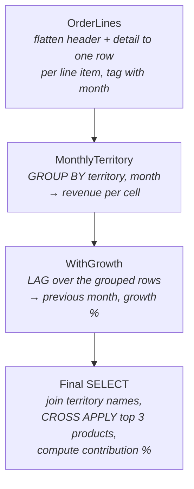

# Lesson 18 — Complex Queries Implementation Plan

> **For agentic workers:** REQUIRED SUB-SKILL: Use superpowers:subagent-driven-development (recommended) or superpowers:executing-plans to implement this plan task-by-task. Steps use checkbox (`- [ ]`) syntax for tracking.

**Goal:** Build `lessons/18-complex-queries/` — a capstone lesson teaching how to compose complex queries (CTE pipelines, APPLY, PIVOT/conditional aggregation, classic patterns) — per the approved spec `docs/superpowers/specs/2026-06-11-complex-queries-lesson-design.md`.

**Architecture:** Standard five-file lesson owning the idempotent `lesson18` schema. A single case study (territory monthly revenue + growth + top-3 products + contribution %) is built incrementally through the README and examples. Two seeded tables (`CustomerStaging` with duplicates, `GymVisit` with date gaps) support patterns AdventureWorks is too clean for.

**Tech Stack:** T-SQL (MSSQL 2022 Developer in Docker container `mssql-learn`), AdventureWorks2022, Markdown + mermaid.

**Branch isolation (user requirement):** ALL implementation work happens in a git worktree on branch `lesson-18-complex-queries`. Do NOT commit lesson files to `master`. Master is only touched at the end if the user chooses to merge.

**Verification command (used throughout; run from the worktree root):**

```bash
SA_PASSWORD=$(grep '^SA_PASSWORD=' docker/.env | cut -d= -f2-)
cat <file.sql> | docker exec -i mssql-learn /opt/mssql-tools18/bin/sqlcmd \
    -S localhost -U sa -P "$SA_PASSWORD" -No
```

Note: `docker/.env` is gitignored and therefore NOT present in a fresh worktree — copy it from the main checkout first (Task 0, Step 3).

---

## File Map

| Action | Path |
|--------|------|
| Create | `lessons/18-complex-queries/setup.sql` |
| Create | `lessons/18-complex-queries/examples.sql` |
| Create | `lessons/18-complex-queries/README.md` |
| Create | `lessons/18-complex-queries/exercises.sql` |
| Create | `lessons/18-complex-queries/exercises-solutions.sql` |
| Modify | `README.md` (curriculum table — add Capstone row) |
| Modify | `CLAUDE.md` (curriculum tiers bullet) |

---

## Task 0: Create the worktree

- [ ] **Step 1: Create an isolated worktree** using the `superpowers:using-git-worktrees` skill (or the native worktree tool), branch name `lesson-18-complex-queries`, based on current `master`.

- [ ] **Step 2: Verify you are NOT on master**

Run: `git branch --show-current`
Expected: `lesson-18-complex-queries`

- [ ] **Step 3: Copy the gitignored env file into the worktree** (needed for verification commands)

```bash
cp /Users/macintoshhd/Desktop/mssql/docker/.env <worktree-root>/docker/.env
```

- [ ] **Step 4: Confirm the database container is up**

Run: `docker ps --filter name=mssql-learn --format '{{.Status}}'`
Expected: starts with `Up`. If not: `docker compose -f docker/docker-compose.yml up -d` (from the main checkout, not the worktree — the compose project and volume already exist).

---

## Task 1: `setup.sql`

**Files:**
- Create: `lessons/18-complex-queries/setup.sql`

- [ ] **Step 1: Write `setup.sql`** (idempotent; house pattern from lesson 17)

```sql
USE AdventureWorks2022;
GO

IF SCHEMA_ID('lesson18') IS NOT NULL
BEGIN
    DECLARE @sql NVARCHAR(MAX) = N'';
    SELECT @sql += 'DROP TABLE lesson18.' + QUOTENAME(name) + ';' + CHAR(10)
    FROM sys.tables WHERE schema_id = SCHEMA_ID('lesson18');
    EXEC sp_executesql @sql;
    DROP SCHEMA lesson18;
END
GO
CREATE SCHEMA lesson18;
GO

-- A staging table with DELIBERATE duplicates (AdventureWorks is too clean).
-- Used by the de-duplication pattern (concept 5) and exercise 6.
CREATE TABLE lesson18.CustomerStaging (
    StagingID INT IDENTITY(1,1) PRIMARY KEY,
    FirstName NVARCHAR(50)  NOT NULL,
    LastName  NVARCHAR(50)  NOT NULL,
    Email     NVARCHAR(100) NOT NULL,
    LoadDate  DATE          NOT NULL
);

-- First load: 50 real people from AdventureWorks
INSERT lesson18.CustomerStaging (FirstName, LastName, Email, LoadDate)
SELECT TOP (50) p.FirstName, p.LastName, ea.EmailAddress, '2026-01-15'
FROM Person.Person AS p
JOIN Person.EmailAddress AS ea ON ea.BusinessEntityID = p.BusinessEntityID
ORDER BY p.BusinessEntityID;

-- Second load arrives later and re-sends every 3rd record (classic ETL duplicate)
INSERT lesson18.CustomerStaging (FirstName, LastName, Email, LoadDate)
SELECT FirstName, LastName, Email, '2026-02-20'
FROM lesson18.CustomerStaging
WHERE StagingID % 3 = 0;

-- A visit log with GAPS in the dates (for the gaps & islands pattern, exercise 7).
CREATE TABLE lesson18.GymVisit (
    MemberID  INT  NOT NULL,
    VisitDate DATE NOT NULL,
    CONSTRAINT PK_lesson18_GymVisit PRIMARY KEY (MemberID, VisitDate)
);

INSERT lesson18.GymVisit (MemberID, VisitDate) VALUES
(1,'2026-03-01'),(1,'2026-03-02'),(1,'2026-03-03'),(1,'2026-03-06'),(1,'2026-03-07'),
(2,'2026-03-01'),(2,'2026-03-03'),(2,'2026-03-04'),(2,'2026-03-05'),(2,'2026-03-10'),
(3,'2026-03-02'),(3,'2026-03-03'),(3,'2026-03-04'),(3,'2026-03-05'),(3,'2026-03-06'),(3,'2026-03-07');

PRINT 'Lesson 18 setup complete.';
```

- [ ] **Step 2: Run it and verify**

```bash
SA_PASSWORD=$(grep '^SA_PASSWORD=' docker/.env | cut -d= -f2-)
cat lessons/18-complex-queries/setup.sql | docker exec -i mssql-learn /opt/mssql-tools18/bin/sqlcmd -S localhost -U sa -P "$SA_PASSWORD" -No
```

Expected output ends with `Lesson 18 setup complete.` and no errors.

- [ ] **Step 3: Run it AGAIN to prove idempotency**

Same command. Expected: same clean output (drop-and-recreate path exercised).

- [ ] **Step 4: Sanity-check seeded data**

```bash
echo "SELECT (SELECT COUNT(*) FROM lesson18.CustomerStaging) AS StagingRows, (SELECT COUNT(*) FROM lesson18.GymVisit) AS VisitRows;" \
| docker exec -i mssql-learn /opt/mssql-tools18/bin/sqlcmd -S localhost -U sa -P "$SA_PASSWORD" -No -d AdventureWorks2022
```

Expected: `StagingRows = 66` (50 + 16 re-sent), `VisitRows = 16`.

- [ ] **Step 5: Commit**

```bash
git add lessons/18-complex-queries/setup.sql
git commit -m "feat: lesson 18 setup.sql - lesson18 schema, CustomerStaging dups, GymVisit gaps"
```

---

## Task 2: `examples.sql`

**Files:**
- Create: `lessons/18-complex-queries/examples.sql`

- [ ] **Step 1: Write `examples.sql`**

```sql
USE AdventureWorks2022;
GO

---------------------------------------------------------------------------
-- CONCEPT 1+2: The case-study pipeline, built step by step.
-- Business question: "For each territory: monthly revenue, month-over-month
-- growth, top 3 products, and each product's contribution %."
---------------------------------------------------------------------------

-- Example 1: Step A — flatten orders to the grain we need (one row per line item)
WITH OrderLines AS (
    SELECT soh.TerritoryID,
           DATEFROMPARTS(YEAR(soh.OrderDate), MONTH(soh.OrderDate), 1) AS OrderMonth,
           sod.ProductID,
           sod.LineTotal
    FROM Sales.SalesOrderHeader AS soh
    JOIN Sales.SalesOrderDetail AS sod ON sod.SalesOrderID = soh.SalesOrderID
)
SELECT TOP (10) * FROM OrderLines;   -- debug technique: SELECT from the intermediate step

-- Example 2: Step B — first aggregation layer (territory × month)
WITH OrderLines AS (
    SELECT soh.TerritoryID,
           DATEFROMPARTS(YEAR(soh.OrderDate), MONTH(soh.OrderDate), 1) AS OrderMonth,
           sod.ProductID,
           sod.LineTotal
    FROM Sales.SalesOrderHeader AS soh
    JOIN Sales.SalesOrderDetail AS sod ON sod.SalesOrderID = soh.SalesOrderID
),
MonthlyTerritory AS (
    SELECT TerritoryID, OrderMonth, SUM(LineTotal) AS MonthRevenue
    FROM OrderLines
    GROUP BY TerritoryID, OrderMonth
)
SELECT TOP (10) * FROM MonthlyTerritory ORDER BY TerritoryID, OrderMonth;

-- Example 3: Step C — window function OVER the grouped result (aggregate of an aggregate)
WITH OrderLines AS (
    SELECT soh.TerritoryID,
           DATEFROMPARTS(YEAR(soh.OrderDate), MONTH(soh.OrderDate), 1) AS OrderMonth,
           sod.ProductID,
           sod.LineTotal
    FROM Sales.SalesOrderHeader AS soh
    JOIN Sales.SalesOrderDetail AS sod ON sod.SalesOrderID = soh.SalesOrderID
),
MonthlyTerritory AS (
    SELECT TerritoryID, OrderMonth, SUM(LineTotal) AS MonthRevenue
    FROM OrderLines
    GROUP BY TerritoryID, OrderMonth
)
SELECT TerritoryID, OrderMonth, MonthRevenue,
       LAG(MonthRevenue) OVER (PARTITION BY TerritoryID ORDER BY OrderMonth) AS PrevMonthRevenue,
       CAST(100.0 * (MonthRevenue - LAG(MonthRevenue) OVER (PARTITION BY TerritoryID ORDER BY OrderMonth))
            / NULLIF(LAG(MonthRevenue) OVER (PARTITION BY TerritoryID ORDER BY OrderMonth), 0)
            AS DECIMAL(10,1)) AS GrowthPct
FROM MonthlyTerritory
ORDER BY TerritoryID, OrderMonth;

---------------------------------------------------------------------------
-- CONCEPT 3: CROSS / OUTER APPLY
---------------------------------------------------------------------------

-- Example 4: top-3-per-group with CROSS APPLY — each territory's 3 biggest orders
SELECT st.Name AS Territory, big.SalesOrderID, big.TotalDue
FROM Sales.SalesTerritory AS st
CROSS APPLY (
    SELECT TOP (3) soh.SalesOrderID, soh.TotalDue
    FROM Sales.SalesOrderHeader AS soh
    WHERE soh.TerritoryID = st.TerritoryID
    ORDER BY soh.TotalDue DESC
) AS big
ORDER BY st.Name, big.TotalDue DESC;

-- Example 5: CROSS vs OUTER APPLY — CROSS silently drops rows with no match.
-- Products that have never sold disappear under CROSS APPLY; OUTER keeps them with NULLs.
SELECT p.Name, lastSale.OrderDate
FROM Production.Product AS p
OUTER APPLY (
    SELECT TOP (1) soh.OrderDate
    FROM Sales.SalesOrderDetail AS sod
    JOIN Sales.SalesOrderHeader AS soh ON soh.SalesOrderID = sod.SalesOrderID
    WHERE sod.ProductID = p.ProductID
    ORDER BY soh.OrderDate DESC
) AS lastSale
WHERE lastSale.OrderDate IS NULL;   -- only possible with OUTER APPLY
-- (504 products in the catalog; 238 have never been sold)

---------------------------------------------------------------------------
-- CONCEPT 4: PIVOT / UNPIVOT and conditional aggregation
---------------------------------------------------------------------------

-- Example 6: PIVOT — territory revenue by year, years as columns
SELECT Name AS Territory, [2011], [2012], [2013], [2014]
FROM (
    SELECT st.Name, YEAR(soh.OrderDate) AS OrderYear, soh.TotalDue
    FROM Sales.SalesOrderHeader AS soh
    JOIN Sales.SalesTerritory  AS st ON st.TerritoryID = soh.TerritoryID
) AS src
PIVOT (SUM(TotalDue) FOR OrderYear IN ([2011], [2012], [2013], [2014])) AS pvt
ORDER BY Territory;

-- Example 7: the same result with conditional aggregation — no PIVOT syntax,
-- and you can mix in other aggregates (like the TotalOrders column) freely.
SELECT st.Name AS Territory,
       SUM(CASE WHEN YEAR(soh.OrderDate) = 2011 THEN soh.TotalDue END) AS [2011],
       SUM(CASE WHEN YEAR(soh.OrderDate) = 2012 THEN soh.TotalDue END) AS [2012],
       SUM(CASE WHEN YEAR(soh.OrderDate) = 2013 THEN soh.TotalDue END) AS [2013],
       SUM(CASE WHEN YEAR(soh.OrderDate) = 2014 THEN soh.TotalDue END) AS [2014],
       COUNT(*) AS TotalOrders
FROM Sales.SalesOrderHeader AS soh
JOIN Sales.SalesTerritory  AS st ON st.TerritoryID = soh.TerritoryID
GROUP BY st.Name
ORDER BY Territory;

-- Example 8: UNPIVOT — wide salesperson measure columns back into rows
SELECT BusinessEntityID, MeasureName, MeasureValue
FROM (
    SELECT BusinessEntityID,
           SalesQuota   AS CurrentQuota,
           SalesYTD     AS YearToDate,
           SalesLastYear AS LastYear
    FROM Sales.SalesPerson
) AS src
UNPIVOT (MeasureValue FOR MeasureName IN (CurrentQuota, YearToDate, LastYear)) AS unp
ORDER BY BusinessEntityID, MeasureName;

---------------------------------------------------------------------------
-- CONCEPT 5: Classic patterns
---------------------------------------------------------------------------

-- Example 9: top-N per group with ROW_NUMBER (compare with Example 4's APPLY version)
WITH Ranked AS (
    SELECT st.Name AS Territory, soh.SalesOrderID, soh.TotalDue,
           ROW_NUMBER() OVER (PARTITION BY st.TerritoryID ORDER BY soh.TotalDue DESC) AS rn
    FROM Sales.SalesOrderHeader AS soh
    JOIN Sales.SalesTerritory  AS st ON st.TerritoryID = soh.TerritoryID
)
SELECT Territory, SalesOrderID, TotalDue
FROM Ranked
WHERE rn <= 3
ORDER BY Territory, TotalDue DESC;

-- Example 10: ties — RANK keeps all rows that tie for a place; TOP WITH TIES
-- does the same for a single (non-grouped) top-N
SELECT TOP (5) WITH TIES p.Name, p.ListPrice
FROM Production.Product AS p
ORDER BY p.ListPrice DESC;

-- Example 11: de-duplication with ROW_NUMBER (preview only — the DELETE version
-- is exercise 6)
WITH Ranked AS (
    SELECT *, ROW_NUMBER() OVER (PARTITION BY Email
                                 ORDER BY LoadDate DESC, StagingID DESC) AS rn
    FROM lesson18.CustomerStaging
)
SELECT Email, COUNT(*) AS Copies
FROM Ranked
GROUP BY Email
HAVING COUNT(*) > 1;

-- Example 12: gaps & islands — consecutive visit streaks per member.
-- Trick: VisitDate minus its row number is CONSTANT within a consecutive run.
WITH Numbered AS (
    SELECT MemberID, VisitDate,
           DATEADD(DAY,
                   -ROW_NUMBER() OVER (PARTITION BY MemberID ORDER BY VisitDate),
                   VisitDate) AS StreakKey
    FROM lesson18.GymVisit
)
SELECT MemberID,
       MIN(VisitDate) AS StreakStart,
       MAX(VisitDate) AS StreakEnd,
       COUNT(*)       AS StreakDays
FROM Numbered
GROUP BY MemberID, StreakKey
ORDER BY MemberID, StreakStart;

-- Example 13: running total + share of period (windowed SUM at two scopes)
WITH MonthlySales AS (
    SELECT DATEFROMPARTS(YEAR(OrderDate), MONTH(OrderDate), 1) AS OrderMonth,
           SUM(TotalDue) AS Revenue
    FROM Sales.SalesOrderHeader
    GROUP BY DATEFROMPARTS(YEAR(OrderDate), MONTH(OrderDate), 1)
)
SELECT OrderMonth, Revenue,
       SUM(Revenue) OVER (ORDER BY OrderMonth
                          ROWS BETWEEN UNBOUNDED PRECEDING AND CURRENT ROW) AS RunningTotal,
       CAST(100.0 * Revenue / SUM(Revenue) OVER () AS DECIMAL(5,2)) AS PctOfAllTime
FROM MonthlySales
ORDER BY OrderMonth;

---------------------------------------------------------------------------
-- THE ASSEMBLED CASE STUDY: pipeline + window functions + APPLY together
---------------------------------------------------------------------------

-- Example 14: the full answer to the business question
WITH OrderLines AS (
    SELECT soh.TerritoryID,
           DATEFROMPARTS(YEAR(soh.OrderDate), MONTH(soh.OrderDate), 1) AS OrderMonth,
           sod.ProductID,
           sod.LineTotal
    FROM Sales.SalesOrderHeader AS soh
    JOIN Sales.SalesOrderDetail AS sod ON sod.SalesOrderID = soh.SalesOrderID
),
MonthlyTerritory AS (
    SELECT TerritoryID, OrderMonth, SUM(LineTotal) AS MonthRevenue
    FROM OrderLines
    GROUP BY TerritoryID, OrderMonth
),
WithGrowth AS (
    SELECT TerritoryID, OrderMonth, MonthRevenue,
           LAG(MonthRevenue) OVER (PARTITION BY TerritoryID ORDER BY OrderMonth) AS PrevMonthRevenue
    FROM MonthlyTerritory
)
SELECT st.Name AS Territory,
       g.OrderMonth,
       g.MonthRevenue,
       CAST(100.0 * (g.MonthRevenue - g.PrevMonthRevenue)
            / NULLIF(g.PrevMonthRevenue, 0) AS DECIMAL(10,1)) AS GrowthPct,
       top3.ProductName,
       top3.ProductRevenue,
       CAST(100.0 * top3.ProductRevenue / g.MonthRevenue AS DECIMAL(5,1)) AS ContributionPct
FROM WithGrowth AS g
JOIN Sales.SalesTerritory AS st ON st.TerritoryID = g.TerritoryID
CROSS APPLY (
    SELECT TOP (3) p.Name AS ProductName, SUM(ol.LineTotal) AS ProductRevenue
    FROM OrderLines AS ol
    JOIN Production.Product AS p ON p.ProductID = ol.ProductID
    WHERE ol.TerritoryID = g.TerritoryID
      AND ol.OrderMonth  = g.OrderMonth
    GROUP BY p.Name
    ORDER BY SUM(ol.LineTotal) DESC
) AS top3
ORDER BY Territory, g.OrderMonth, top3.ProductRevenue DESC;
```

- [ ] **Step 2: Run the whole file and verify no errors**

```bash
SA_PASSWORD=$(grep '^SA_PASSWORD=' docker/.env | cut -d= -f2-)
cat lessons/18-complex-queries/examples.sql | docker exec -i mssql-learn /opt/mssql-tools18/bin/sqlcmd -S localhost -U sa -P "$SA_PASSWORD" -No > /tmp/lesson18-examples.out 2>&1
grep -ci "Msg [0-9]" /tmp/lesson18-examples.out
```

Expected: `0` (no error messages). Spot-check `/tmp/lesson18-examples.out`: Example 12 should show member 1 with two streaks (Mar 1–3, Mar 6–7); Example 14 should show territories with three product rows per month. **If row counts or claims in comments (e.g., "238 have never been sold") don't match reality, fix the comment to match the actual output — never leave a wrong claim in lesson content.**

- [ ] **Step 3: Commit**

```bash
git add lessons/18-complex-queries/examples.sql
git commit -m "feat: lesson 18 examples - case study pipeline, APPLY, PIVOT, classic patterns"
```

---

## Task 3: `README.md`

**Files:**
- Create: `lessons/18-complex-queries/README.md`

- [ ] **Step 1: Write the README.** Follow the house structure (What you'll learn / Setup / Concepts / Worked Examples / Pitfalls / Cheatsheet link / Exercises). Full content:

````markdown
# Lesson 18 — Complex Queries (Capstone)

**Prerequisites:** Lessons 06 (subqueries & CTEs) and 07 (window functions). Lesson 13
(plan reading) helps for checking your work but isn't required.

You know each technique in isolation. This lesson is about **combining them**: taking a
multi-part business question and turning it into a correct, readable query — without
writing one giant unreadable statement.

## What you'll learn

- A repeatable strategy for decomposing a complex question into named steps
- Multi-CTE pipelines: layered aggregation, window functions over grouped results
- `CROSS APPLY` / `OUTER APPLY`: per-row subqueries and top-N-per-group
- `PIVOT` / `UNPIVOT`, and why conditional aggregation is often the better tool
- The classic patterns: top-N per group, de-duplication, gaps & islands, period comparisons

## Setup

Run `setup.sql` once. It creates the `lesson18` schema plus two tables AdventureWorks is
too clean to provide: `CustomerStaging` (contains deliberate duplicates) and `GymVisit`
(visit dates with gaps).

## The Case Study

Everything in this lesson builds one report:

> "For each sales territory: monthly revenue, month-over-month growth, the top 3 products,
> and each product's contribution % to territory revenue."

Don't try to write that as one statement. Decompose it:



Each box becomes a named CTE. Each CTE is independently testable: while building, end the
query with `SELECT * FROM <that CTE>` and eyeball the output before adding the next layer.

## Concepts

### 1. Strategy: name the steps before writing SQL

Write the skeleton first — names and comments, no logic:

```sql
WITH OrderLines AS (
    -- one row per order line, tagged with territory + month
    SELECT 1 AS placeholder
),
MonthlyTerritory AS (
    -- revenue per territory per month
    SELECT 1 AS placeholder
),
WithGrowth AS (
    -- add previous month + growth % via LAG
    SELECT 1 AS placeholder
)
SELECT 1;  -- final shape
```

Then fill in one CTE at a time, testing each with `SELECT TOP (10) * FROM <cte>`.
A complex query you built this way is never scary — it's just steps.

### 2. Multi-CTE pipelines

Two rules of thumb:

- **Each CTE changes the grain once.** `OrderLines` is at line-item grain;
  `MonthlyTerritory` collapses it to territory×month. One grain change per step keeps
  every step explainable.
- **Window functions come *after* GROUP BY collapses the rows** — put the `GROUP BY` in
  one CTE and the `LAG`/`SUM() OVER` in the next. (An "aggregate of an aggregate" like
  *average monthly revenue* is just two pipeline steps: SUM per month, then AVG.)

### 3. CROSS APPLY / OUTER APPLY

`APPLY` runs the right side **once per row of the left side** — a subquery that can see
the current row. The killer use: top-N-per-group.

```sql
SELECT st.Name, big.SalesOrderID, big.TotalDue
FROM Sales.SalesTerritory AS st
CROSS APPLY (
    SELECT TOP (3) soh.SalesOrderID, soh.TotalDue
    FROM Sales.SalesOrderHeader AS soh
    WHERE soh.TerritoryID = st.TerritoryID   -- ← sees the outer row
    ORDER BY soh.TotalDue DESC
) AS big;
```

- `CROSS APPLY` = inner-join semantics: left rows with **no** right rows disappear.
- `OUTER APPLY` = left-join semantics: left rows survive with NULLs.

### 4. PIVOT, UNPIVOT, and conditional aggregation

`PIVOT` turns rows into columns, but demands an exact column list and exactly one
aggregate. **Conditional aggregation** does the same job with plain GROUP BY and mixes
freely with other aggregates:

```sql
SELECT st.Name,
       SUM(CASE WHEN YEAR(soh.OrderDate) = 2013 THEN soh.TotalDue END) AS [2013],
       SUM(CASE WHEN YEAR(soh.OrderDate) = 2014 THEN soh.TotalDue END) AS [2014],
       COUNT(*) AS TotalOrders            -- ← impossible inside a PIVOT
FROM Sales.SalesOrderHeader AS soh
JOIN Sales.SalesTerritory  AS st ON st.TerritoryID = soh.TerritoryID
GROUP BY st.Name;
```

Reach for `PIVOT` when the syntax reads cleaner; reach for conditional aggregation when
you need flexibility. `UNPIVOT` goes the other way (columns → rows) — handy for
normalizing wide tables.

### 5. The classic patterns

| Pattern | Tool | One-line recipe |
|---|---|---|
| Top-N per group | `ROW_NUMBER` or `CROSS APPLY` | Rank within partition, filter `rn <= N` — or APPLY a `TOP (N)` subquery |
| Ties at the boundary | `RANK` / `TOP WITH TIES` | `RANK` repeats numbers for ties; `WITH TIES` extends a single top-N |
| De-duplication | `ROW_NUMBER` + `DELETE` | Partition by the duplicate key, order by "which copy wins", delete `rn > 1` |
| Gaps & islands | `ROW_NUMBER` difference | `date - row_number` is constant within a consecutive run; GROUP BY that |
| Period comparison | `LAG` over grouped rows | GROUP to period grain first, then `LAG(...) OVER (PARTITION ... ORDER BY period)` |
| Share of total | windowed `SUM` | `value / SUM(value) OVER (PARTITION BY scope)` |

## Worked Examples

`examples.sql` builds the case study incrementally (examples 1–3), demos APPLY (4–5),
PIVOT/UNPIVOT/conditional aggregation (6–8), the classic patterns (9–13), and assembles
the full case-study query (14). Run it section by section, not all at once.

## Pitfalls

- **CTEs are not temp tables.** Referencing the same CTE twice executes it twice. If a
  step is expensive and reused, materialize it into a `#temp` table instead.
- **CROSS APPLY silently drops rows** when the inner query returns nothing. If the left
  side must survive, you wanted `OUTER APPLY`.
- **`ORDER BY` inside a CTE or subquery does not order the result** (it's only legal
  with `TOP`). Order in the outermost SELECT.
- **Window functions can't go in `WHERE`** — they're computed at SELECT time (see
  cheatsheet 00's logical order). Compute in a CTE, filter in the next step.
- **PIVOT needs literal column values.** Dynamic categories require dynamic SQL — usually
  a sign you want conditional aggregation or to pivot in the application layer.

## Cheatsheet link

See `cheatsheets/01-tsql-syntax.md`, `cheatsheets/04-window-functions.md`, and the
logical-execution-order diagram in `cheatsheets/00-how-mssql-works.md`.

## Exercises

Open `exercises.sql` — eight exercises ramping from CTE-pipeline warm-ups to a final boss
that mirrors the case study on Purchasing data. Solutions with explanations are in
`exercises-solutions.sql`.
````

- [ ] **Step 2: Commit**

```bash
git add lessons/18-complex-queries/README.md
git commit -m "feat: lesson 18 README - strategy, pipelines, APPLY, patterns"
```

---

## Task 4: `exercises.sql`

**Files:**
- Create: `lessons/18-complex-queries/exercises.sql`

- [ ] **Step 1: Write `exercises.sql`**

```sql
USE AdventureWorks2022;
GO
-- Lesson 18 exercises. Run setup.sql first.
-- Write your answers below each exercise comment.

---------------------------------------------------------------------------
-- Exercise 1 (warm-up): Rewrite as a CTE pipeline.
-- The query below answers "products whose total sales beat the average
-- product's total sales" — but as an unreadable nest. Rewrite it as two
-- CTEs (ProductTotals, then the comparison) producing the same rows.
---------------------------------------------------------------------------
SELECT p.Name, t.TotalSold
FROM (SELECT ProductID, SUM(LineTotal) AS TotalSold
      FROM Sales.SalesOrderDetail GROUP BY ProductID) AS t
JOIN Production.Product AS p ON p.ProductID = t.ProductID
WHERE t.TotalSold > (SELECT AVG(x.TotalSold)
                     FROM (SELECT SUM(LineTotal) AS TotalSold
                           FROM Sales.SalesOrderDetail
                           GROUP BY ProductID) AS x);

---------------------------------------------------------------------------
-- Exercise 2 (layered aggregation): For each territory, compute the AVERAGE
-- MONTHLY revenue (average of the monthly SUMs of TotalDue), highest first.
-- Two pipeline steps: month sums, then the average of those.
---------------------------------------------------------------------------

---------------------------------------------------------------------------
-- Exercise 3 (top-N per group, ROW_NUMBER): For each territory, the top 3
-- customers by lifetime TotalDue. Output: territory name, CustomerID,
-- lifetime spend, rank.
---------------------------------------------------------------------------

---------------------------------------------------------------------------
-- Exercise 4 (top-N per group, APPLY): For each salesperson in
-- Sales.SalesPerson, their 3 most recent orders (SalesOrderID, OrderDate,
-- TotalDue). Salespeople with no orders must still appear.
-- Hint: which APPLY keeps left rows alive?
---------------------------------------------------------------------------

---------------------------------------------------------------------------
-- Exercise 5 (conditional aggregation): One row per territory, columns for
-- order COUNTS in 2012, 2013, 2014, plus a TotalOrders column.
-- No PIVOT allowed.
---------------------------------------------------------------------------

---------------------------------------------------------------------------
-- Exercise 6 (de-duplication): lesson18.CustomerStaging contains duplicate
-- emails from a re-sent ETL batch. DELETE the duplicates, keeping the row
-- with the newest LoadDate (break remaining ties by highest StagingID).
-- Verify: SELECT COUNT(*) afterwards should equal the number of distinct emails.
---------------------------------------------------------------------------

---------------------------------------------------------------------------
-- Exercise 7 (gaps & islands): Using lesson18.GymVisit, find each member's
-- LONGEST consecutive-day visit streak. Output: MemberID, StreakStart,
-- StreakEnd, StreakDays — one row per member.
---------------------------------------------------------------------------

---------------------------------------------------------------------------
-- Exercise 8 (final boss): The purchasing department wants the case-study
-- report for VENDORS: for each vendor — monthly purchase total (from
-- Purchasing.PurchaseOrderHeader.TotalDue), month-over-month growth %, and
-- the top 2 products by line total that month (from
-- Purchasing.PurchaseOrderDetail), with each product's contribution % to
-- that vendor's monthly total.
-- Structure it as a pipeline: lines → vendor-month totals → growth → APPLY top products.
---------------------------------------------------------------------------
```

- [ ] **Step 2: Verify the embedded Exercise 1 query actually runs** (it's the only executable SQL in the file)

```bash
SA_PASSWORD=$(grep '^SA_PASSWORD=' docker/.env | cut -d= -f2-)
cat lessons/18-complex-queries/exercises.sql | docker exec -i mssql-learn /opt/mssql-tools18/bin/sqlcmd -S localhost -U sa -P "$SA_PASSWORD" -No | grep -ci "Msg [0-9]"
```

Expected: `0`.

- [ ] **Step 3: Commit**

```bash
git add lessons/18-complex-queries/exercises.sql
git commit -m "feat: lesson 18 exercises - 8 exercises ramping to purchasing final boss"
```

---

## Task 5: `exercises-solutions.sql`

**Files:**
- Create: `lessons/18-complex-queries/exercises-solutions.sql`

- [ ] **Step 1: Write `exercises-solutions.sql`** (house style: 1–2 line approach comment per solution)

```sql
USE AdventureWorks2022;
GO
-- Lesson 18 solutions. Each solution has a short note on the approach.

---------------------------------------------------------------------------
-- Solution 1: Name each step. ProductTotals computes once; the AVG over it
-- reuses the same CTE instead of repeating the derived table twice.
---------------------------------------------------------------------------
WITH ProductTotals AS (
    SELECT ProductID, SUM(LineTotal) AS TotalSold
    FROM Sales.SalesOrderDetail
    GROUP BY ProductID
)
SELECT p.Name, pt.TotalSold
FROM ProductTotals AS pt
JOIN Production.Product AS p ON p.ProductID = pt.ProductID
WHERE pt.TotalSold > (SELECT AVG(TotalSold) FROM ProductTotals);

---------------------------------------------------------------------------
-- Solution 2: Two grain changes, one per CTE: order → territory-month sums,
-- then territory-month → territory average.
---------------------------------------------------------------------------
WITH MonthlyRevenue AS (
    SELECT soh.TerritoryID,
           DATEFROMPARTS(YEAR(soh.OrderDate), MONTH(soh.OrderDate), 1) AS OrderMonth,
           SUM(soh.TotalDue) AS Revenue
    FROM Sales.SalesOrderHeader AS soh
    GROUP BY soh.TerritoryID, DATEFROMPARTS(YEAR(soh.OrderDate), MONTH(soh.OrderDate), 1)
)
SELECT st.Name AS Territory, AVG(mr.Revenue) AS AvgMonthlyRevenue
FROM MonthlyRevenue AS mr
JOIN Sales.SalesTerritory AS st ON st.TerritoryID = mr.TerritoryID
GROUP BY st.Name
ORDER BY AvgMonthlyRevenue DESC;

---------------------------------------------------------------------------
-- Solution 3: Rank inside a partition, filter outside — window functions
-- can't appear in WHERE, hence the wrapping CTE.
---------------------------------------------------------------------------
WITH CustomerSpend AS (
    SELECT soh.TerritoryID, soh.CustomerID, SUM(soh.TotalDue) AS LifetimeSpend
    FROM Sales.SalesOrderHeader AS soh
    GROUP BY soh.TerritoryID, soh.CustomerID
),
Ranked AS (
    SELECT *, ROW_NUMBER() OVER (PARTITION BY TerritoryID
                                 ORDER BY LifetimeSpend DESC) AS rn
    FROM CustomerSpend
)
SELECT st.Name AS Territory, r.CustomerID, r.LifetimeSpend, r.rn
FROM Ranked AS r
JOIN Sales.SalesTerritory AS st ON st.TerritoryID = r.TerritoryID
WHERE r.rn <= 3
ORDER BY st.Name, r.rn;

---------------------------------------------------------------------------
-- Solution 4: OUTER APPLY keeps salespeople with no orders (NULL columns);
-- CROSS APPLY would silently drop them.
---------------------------------------------------------------------------
SELECT sp.BusinessEntityID, recent.SalesOrderID, recent.OrderDate, recent.TotalDue
FROM Sales.SalesPerson AS sp
OUTER APPLY (
    SELECT TOP (3) soh.SalesOrderID, soh.OrderDate, soh.TotalDue
    FROM Sales.SalesOrderHeader AS soh
    WHERE soh.SalesPersonID = sp.BusinessEntityID
    ORDER BY soh.OrderDate DESC
) AS recent
ORDER BY sp.BusinessEntityID, recent.OrderDate DESC;

---------------------------------------------------------------------------
-- Solution 5: COUNT(CASE WHEN ...) counts only matching rows because CASE
-- yields NULL otherwise, and COUNT ignores NULLs.
---------------------------------------------------------------------------
SELECT st.Name AS Territory,
       COUNT(CASE WHEN YEAR(soh.OrderDate) = 2012 THEN 1 END) AS Orders2012,
       COUNT(CASE WHEN YEAR(soh.OrderDate) = 2013 THEN 1 END) AS Orders2013,
       COUNT(CASE WHEN YEAR(soh.OrderDate) = 2014 THEN 1 END) AS Orders2014,
       COUNT(*) AS TotalOrders
FROM Sales.SalesOrderHeader AS soh
JOIN Sales.SalesTerritory  AS st ON st.TerritoryID = soh.TerritoryID
GROUP BY st.Name
ORDER BY Territory;

---------------------------------------------------------------------------
-- Solution 6: You can DELETE through a CTE. rn = 1 marks the keeper per
-- email (newest load, then highest StagingID); everything else goes.
---------------------------------------------------------------------------
WITH Ranked AS (
    SELECT *, ROW_NUMBER() OVER (PARTITION BY Email
                                 ORDER BY LoadDate DESC, StagingID DESC) AS rn
    FROM lesson18.CustomerStaging
)
DELETE FROM Ranked WHERE rn > 1;

-- Verification: both counts must match
SELECT COUNT(*) AS RemainingRows, COUNT(DISTINCT Email) AS DistinctEmails
FROM lesson18.CustomerStaging;

---------------------------------------------------------------------------
-- Solution 7: date - row_number is constant per consecutive run (the
-- "islands" trick); group on it, then keep each member's longest island.
---------------------------------------------------------------------------
WITH Numbered AS (
    SELECT MemberID, VisitDate,
           DATEADD(DAY,
                   -ROW_NUMBER() OVER (PARTITION BY MemberID ORDER BY VisitDate),
                   VisitDate) AS StreakKey
    FROM lesson18.GymVisit
),
Streaks AS (
    SELECT MemberID,
           MIN(VisitDate) AS StreakStart,
           MAX(VisitDate) AS StreakEnd,
           COUNT(*)       AS StreakDays,
           ROW_NUMBER() OVER (PARTITION BY MemberID
                              ORDER BY COUNT(*) DESC, MIN(VisitDate)) AS rn
    FROM Numbered
    GROUP BY MemberID, StreakKey
)
SELECT MemberID, StreakStart, StreakEnd, StreakDays
FROM Streaks
WHERE rn = 1
ORDER BY MemberID;

---------------------------------------------------------------------------
-- Solution 8: Same pipeline shape as the case study — flatten, group to
-- vendor-month, LAG for growth, APPLY for the per-month top products.
---------------------------------------------------------------------------
WITH PoLines AS (
    SELECT poh.VendorID,
           DATEFROMPARTS(YEAR(poh.OrderDate), MONTH(poh.OrderDate), 1) AS OrderMonth,
           pod.ProductID,
           pod.LineTotal
    FROM Purchasing.PurchaseOrderHeader AS poh
    JOIN Purchasing.PurchaseOrderDetail AS pod ON pod.PurchaseOrderID = poh.PurchaseOrderID
),
VendorMonthly AS (
    SELECT VendorID, OrderMonth, SUM(LineTotal) AS MonthTotal
    FROM PoLines
    GROUP BY VendorID, OrderMonth
),
WithGrowth AS (
    SELECT VendorID, OrderMonth, MonthTotal,
           LAG(MonthTotal) OVER (PARTITION BY VendorID ORDER BY OrderMonth) AS PrevMonthTotal
    FROM VendorMonthly
)
SELECT v.Name AS Vendor,
       g.OrderMonth,
       g.MonthTotal,
       CAST(100.0 * (g.MonthTotal - g.PrevMonthTotal)
            / NULLIF(g.PrevMonthTotal, 0) AS DECIMAL(10,1)) AS GrowthPct,
       top2.ProductName,
       top2.ProductTotal,
       CAST(100.0 * top2.ProductTotal / g.MonthTotal AS DECIMAL(5,1)) AS ContributionPct
FROM WithGrowth AS g
JOIN Purchasing.Vendor AS v ON v.BusinessEntityID = g.VendorID
CROSS APPLY (
    SELECT TOP (2) p.Name AS ProductName, SUM(pl.LineTotal) AS ProductTotal
    FROM PoLines AS pl
    JOIN Production.Product AS p ON p.ProductID = pl.ProductID
    WHERE pl.VendorID  = g.VendorID
      AND pl.OrderMonth = g.OrderMonth
    GROUP BY p.Name
    ORDER BY SUM(pl.LineTotal) DESC
) AS top2
ORDER BY Vendor, g.OrderMonth, top2.ProductTotal DESC;
```

- [ ] **Step 2: Re-run setup, then run solutions end-to-end** (solution 6 mutates `CustomerStaging`, so always reset first)

```bash
SA_PASSWORD=$(grep '^SA_PASSWORD=' docker/.env | cut -d= -f2-)
cat lessons/18-complex-queries/setup.sql | docker exec -i mssql-learn /opt/mssql-tools18/bin/sqlcmd -S localhost -U sa -P "$SA_PASSWORD" -No
cat lessons/18-complex-queries/exercises-solutions.sql | docker exec -i mssql-learn /opt/mssql-tools18/bin/sqlcmd -S localhost -U sa -P "$SA_PASSWORD" -No > /tmp/lesson18-solutions.out 2>&1
grep -ci "Msg [0-9]" /tmp/lesson18-solutions.out
```

Expected: `0`. Spot-check `/tmp/lesson18-solutions.out`:
- Solution 6 verification row: `RemainingRows = DistinctEmails`
- Solution 7: exactly 3 rows (one per member); member 3's streak is 6 days (Mar 2–7)

- [ ] **Step 3: Commit**

```bash
git add lessons/18-complex-queries/exercises-solutions.sql
git commit -m "feat: lesson 18 solutions with approach comments"
```

---

## Task 6: Curriculum docs

**Files:**
- Modify: `README.md` (curriculum table, ~line 44)
- Modify: `CLAUDE.md` (curriculum tiers bullet)

- [ ] **Step 1: Add the capstone row to the root README curriculum table**

Find:

```markdown
| 4 — Performance | 12–13 | Indexes, Execution Plans & Query Tuning |
```

The table currently ends after a tier-5/internals row if one exists, or after tier 4. Append after the LAST row of the table:

```markdown
| Capstone | 18 | Complex Queries (CTE pipelines, APPLY, patterns) |
```

(If the table has no row for lessons 14–17, also leave that as-is — only add the capstone row. Do not renumber or rewrite other rows.)

- [ ] **Step 2: Update the CLAUDE.md tiers bullet**

Find in `CLAUDE.md`:

```markdown
- Curriculum tiers: 01–04 foundations, 05–08 working with data, 09–11 programming, 12–13 performance, 14–17 internals (storage, optimizer, memory/log, locking/waits). The internals tier has its own design spec (`docs/superpowers/specs/2026-05-30-mssql-internals-tier5-design.md`).
```

Replace with:

```markdown
- Curriculum tiers: 01–04 foundations, 05–08 working with data, 09–11 programming, 12–13 performance, 14–17 internals (storage, optimizer, memory/log, locking/waits), 18 capstone (complex queries). The internals tier has its own design spec (`docs/superpowers/specs/2026-05-30-mssql-internals-tier5-design.md`); the capstone's is `docs/superpowers/specs/2026-06-11-complex-queries-lesson-design.md`.
```

- [ ] **Step 3: Commit**

```bash
git add README.md CLAUDE.md
git commit -m "docs: add lesson 18 capstone to curriculum docs"
```

---

## Task 7: Final end-to-end verification

- [ ] **Step 1: Fresh-schema full run** — setup, examples, solutions, in order:

```bash
SA_PASSWORD=$(grep '^SA_PASSWORD=' docker/.env | cut -d= -f2-)
for f in setup examples exercises-solutions; do
  echo "=== $f ==="
  cat lessons/18-complex-queries/$f.sql | docker exec -i mssql-learn /opt/mssql-tools18/bin/sqlcmd \
      -S localhost -U sa -P "$SA_PASSWORD" -No 2>&1 | grep -i "Msg [0-9]" && echo "ERRORS IN $f" || echo "OK"
done
```

Expected: three `OK` lines, no `ERRORS IN` lines.

- [ ] **Step 2: Check the five-file convention is satisfied**

Run: `ls lessons/18-complex-queries/`
Expected: exactly `README.md examples.sql exercises-solutions.sql exercises.sql setup.sql`

- [ ] **Step 3: Review the diff against master**

Run: `git log --oneline master..HEAD` — expect the 5 commits from Tasks 1–6.
Run: `git diff master --stat` — expect only the 7 files from the File Map.

- [ ] **Step 4: STOP — do not merge.** Report to the user that the branch `lesson-18-complex-queries` is ready in the worktree, and let them decide on merging (use superpowers:finishing-a-development-branch).
