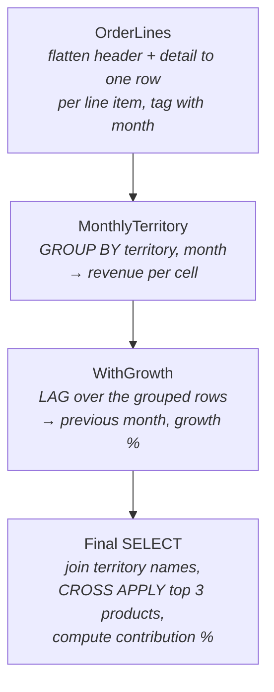

# Lesson 18 — Complex Queries (Capstone)

**Prerequisites:** Lessons 06 (subqueries & CTEs) and 07 (window functions). Lesson 13
(plan reading) helps for checking your work but isn't required.

You know each technique in isolation. This lesson is about **combining them**: taking a
multi-part business question and turning it into a correct, readable query — without
writing one giant unreadable statement.

## What you'll learn

- A repeatable strategy for decomposing a complex question into named steps
- Multi-CTE pipelines: layered aggregation, window functions over grouped results
- `CROSS APPLY` / `OUTER APPLY`: per-row subqueries and top-N-per-group
- `PIVOT` / `UNPIVOT`, and why conditional aggregation is often the better tool
- The classic patterns: top-N per group, de-duplication, gaps & islands, period comparisons

## Setup

Run `setup.sql` once. It creates the `lesson18` schema plus two tables AdventureWorks is
too clean to provide: `CustomerStaging` (contains deliberate duplicates) and `GymVisit`
(visit dates with gaps).

## The Case Study

Everything in this lesson builds one report:

> "For each sales territory: monthly revenue, month-over-month growth, the top 3 products,
> and each product's contribution % to territory revenue."

Don't try to write that as one statement. Decompose it:



Each box becomes a named CTE. Each CTE is independently testable: while building, end the
query with `SELECT * FROM <that CTE>` and eyeball the output before adding the next layer.

## Concepts

### 1. Strategy: name the steps before writing SQL

Write the skeleton first — names and comments, no logic:

```sql
WITH OrderLines AS (
    -- one row per order line, tagged with territory + month
    SELECT 1 AS placeholder
),
MonthlyTerritory AS (
    -- revenue per territory per month
    SELECT 1 AS placeholder
),
WithGrowth AS (
    -- add previous month + growth % via LAG
    SELECT 1 AS placeholder
)
SELECT 1;  -- final shape
```

Then fill in one CTE at a time, testing each with `SELECT TOP (10) * FROM <cte>`.
A complex query you built this way is never scary — it's just steps.

### 2. Multi-CTE pipelines

Two rules of thumb:

- **Each CTE changes the grain once.** `OrderLines` is at line-item grain;
  `MonthlyTerritory` collapses it to territory×month. One grain change per step keeps
  every step explainable.
- **Window functions come *after* GROUP BY collapses the rows** — put the `GROUP BY` in
  one CTE and the `LAG`/`SUM() OVER` in the next. (An "aggregate of an aggregate" like
  *average monthly revenue* is just two pipeline steps: SUM per month, then AVG.)

### 3. CROSS APPLY / OUTER APPLY

`APPLY` runs the right side **once per row of the left side** — a subquery that can see
the current row. The killer use: top-N-per-group.

```sql
SELECT st.Name, big.SalesOrderID, big.TotalDue
FROM Sales.SalesTerritory AS st
CROSS APPLY (
    SELECT TOP (3) soh.SalesOrderID, soh.TotalDue
    FROM Sales.SalesOrderHeader AS soh
    WHERE soh.TerritoryID = st.TerritoryID   -- ← sees the outer row
    ORDER BY soh.TotalDue DESC
) AS big;
```

- `CROSS APPLY` = inner-join semantics: left rows with **no** right rows disappear.
- `OUTER APPLY` = left-join semantics: left rows survive with NULLs.

### 4. PIVOT, UNPIVOT, and conditional aggregation

`PIVOT` turns rows into columns, but demands an exact column list and exactly one
aggregate. **Conditional aggregation** does the same job with plain GROUP BY and mixes
freely with other aggregates:

```sql
SELECT st.Name,
       SUM(CASE WHEN YEAR(soh.OrderDate) = 2013 THEN soh.TotalDue END) AS [2013],
       SUM(CASE WHEN YEAR(soh.OrderDate) = 2014 THEN soh.TotalDue END) AS [2014],
       COUNT(*) AS TotalOrders            -- ← impossible inside a PIVOT
FROM Sales.SalesOrderHeader AS soh
JOIN Sales.SalesTerritory  AS st ON st.TerritoryID = soh.TerritoryID
GROUP BY st.Name;
```

Reach for `PIVOT` when the syntax reads cleaner; reach for conditional aggregation when
you need flexibility. `UNPIVOT` goes the other way (columns → rows) — handy for
normalizing wide tables.

### 5. The classic patterns

| Pattern | Tool | One-line recipe |
|---|---|---|
| Top-N per group | `ROW_NUMBER` or `CROSS APPLY` | Rank within partition, filter `rn <= N` — or APPLY a `TOP (N)` subquery |
| Ties at the boundary | `RANK` / `TOP WITH TIES` | `RANK` repeats numbers for ties; `WITH TIES` extends a single top-N |
| De-duplication | `ROW_NUMBER` + `DELETE` | Partition by the duplicate key, order by "which copy wins", delete `rn > 1` |
| Gaps & islands | `ROW_NUMBER` difference | `date - row_number` is constant within a consecutive run; GROUP BY that |
| Period comparison | `LAG` over grouped rows | GROUP to period grain first, then `LAG(...) OVER (PARTITION ... ORDER BY period)` |
| Share of total | windowed `SUM` | `value / SUM(value) OVER (PARTITION BY scope)` |

## Worked Examples

`examples.sql` builds the case study incrementally (examples 1–3), demos APPLY (4–5),
PIVOT/UNPIVOT/conditional aggregation (6–8), the classic patterns (9–13), and assembles
the full case-study query (14). Run it section by section, not all at once.

## Pitfalls

- **CTEs are not temp tables.** Referencing the same CTE twice executes it twice. If a
  step is expensive and reused, materialize it into a `#temp` table instead.
- **CROSS APPLY silently drops rows** when the inner query returns nothing. If the left
  side must survive, you wanted `OUTER APPLY`.
- **`ORDER BY` inside a CTE or subquery does not order the result** (it's only legal
  with `TOP`). Order in the outermost SELECT.
- **Window functions can't go in `WHERE`** — they're computed at SELECT time (see
  cheatsheet 00's logical order). Compute in a CTE, filter in the next step.
- **PIVOT needs literal column values.** Dynamic categories require dynamic SQL — usually
  a sign you want conditional aggregation or to pivot in the application layer.

## Cheatsheet link

See `cheatsheets/01-tsql-syntax.md`, `cheatsheets/04-window-functions.md`, and the
logical-execution-order diagram in `cheatsheets/00-how-mssql-works.md`.

## Exercises

Open `exercises.sql` — eight exercises ramping from CTE-pipeline warm-ups to a final boss
that mirrors the case study on Purchasing data. Solutions with explanations are in
`exercises-solutions.sql`.
